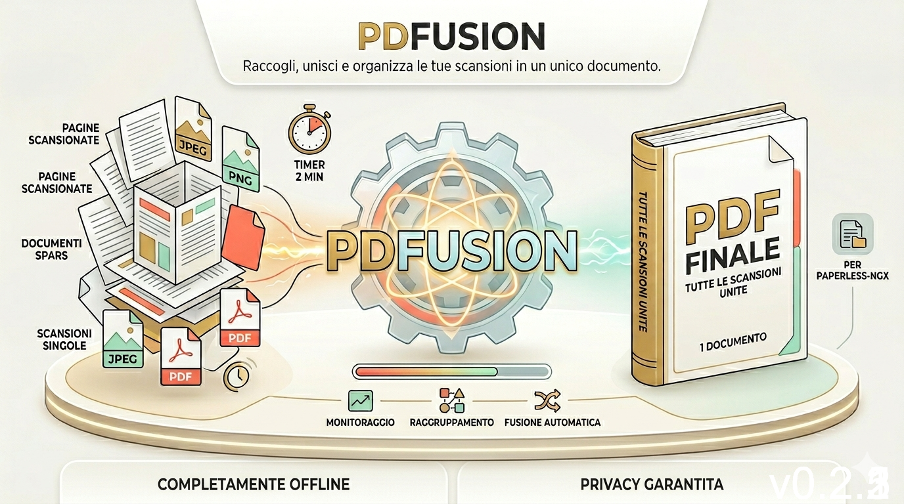

# PDFusion

A powerful, open-source desktop application for PDF manipulation built with PyQt6.



[]()
[]()
[]()
[]()
[]()
[]()

---

## Table of Contents

### Getting Started

- [Features](#-features)
- [System Requirements](#️-system-requirements)
- [Installation](#-installation)
- [Quick Start](#-quick-start)

### Tools & Usage

- [Tool Reference](#️-tool-reference) — Complete guide to all 16 tools

### For Developers

- [Development](#-development)
- [Project Structure](#project-structure)
- [Technology Stack](#-technology-stack)
- [Contributing](#-contributing)

### Troubleshooting & Help

- [Tips & Tricks](#-tips--tricks)
- [Known Limitations](#️-known-limitations)
- [Troubleshooting](#-troubleshooting)

### Resources

- [Additional Resources](#-additional-resources)
- [License](#-license)

---

## Quick Overview

PDFusion is a feature-rich, offline-first PDF manipulation suite. With **16 integrated tools**, intuitive UI, and zero cloud dependencies, it's perfect for document processing workflows. Whether you need to merge, split, protect, or convert PDFs—PDFusion handles it all locally on your machine.

---

## ✨ Features

**PDFusion includes 16 professional tools:**

### Document Operations

- 📄 **Merge** — Combine multiple PDFs into one
- ✂️ **Split** — Divide PDFs by page ranges or individual files
- 🔄 **Reorder** — Rearrange pages with intuitive controls
- 🎯 **Rotate** — Rotate pages 90°/180°/270°
- 📋 **Extract & Delete** — Work with specific page ranges
- 📝 **Insert Page** — Add blank pages at any position

### Security & Protection

- 🔒 **Protect** — Password encryption (AES-128/256) with permission restrictions
- 🎨 **Watermark** — Add text or images (7 positions, custom opacity/rotation)

### Content Management

- 📝 **Headers & Footers** — Add custom text with dynamic variables
- 📃 **License Pages** — Insert branded license pages (11+ templates)
- 📊 **Metadata** — Edit PDF title, author, subject, and other properties

### Conversion & Processing

- 📸 **Convert** — PDF↔Images (PNG/JPG/TIFF), image collections→PDF
- 🗜️ **Compress** — Reduce file size with quality presets (Screen/eBook/Print/Prepress)
- 🔄 **Batch Processing** — Process multiple files in parallel
- 📅 **Dynamic Variables** — Auto-fill {page}, {total}, {date}, {title}, {author}

---

## 🖥️ System Requirements

| Requirement | Specification |
|---|---|
| **Python** | 3.11–3.13 |
| **OS** | Windows 10+, macOS 11+, Linux (Debian/Ubuntu/Fedora) |
| **RAM** | 2 GB minimum, 4 GB recommended |
| **Disk Space** | ~300 MB (depends on installers) |

---

## 📦 Installation

### From Source

```bash
# Clone repository
git clone https://github.com/overwrite00/PDFusion.git
cd PDFusion

# Create virtual environment
python -m venv .venv

# Activate virtual environment
# On Windows:
.venv\Scripts\activate
# On macOS/Linux:
source .venv/bin/activate

# Install dependencies
pip install -r requirements.txt

# Run application
python src/main.py
```

### Pre-built Installers

Pre-built executables available in [Releases](https://github.com/overwrite00/PDFusion/releases):

| Platform | Installer | Type |
|---|---|---|
| **Windows** | `PDFusion-0.2.3-windows-setup.exe` | NSIS installer |
| **macOS** | `PDFusion-0.2.3-macos.dmg` | Disk image |
| **Linux** | `PDFusion-0.2.3-linux.AppImage` | Portable executable |

[⬆ Back to Top](#table-of-contents)

---

## 🚀 Quick Start

1. **Open PDFusion** — Launch the application
2. **Load PDF** — Use File menu or drag-and-drop to load your PDF
3. **Select Tool** — Click a tool from the left sidebar
4. **Configure** — Adjust settings in the right panel
5. **Apply** — Click **Apply** to preview, or **Apply and Save As** to save

### Example Workflows

#### Workflow 1: Split PDF by ranges

1. Open PDF → Select "Split" tool
2. Enter ranges: `1-5, 10-15, 20`
3. Click "Apply and Save As"
4. Choose output directory

#### Workflow 2: Add watermark

1. Open PDF → Select "Watermark" tool
2. Choose text or image mode
3. Select position (e.g., CENTER_DIAGONAL)
4. Adjust opacity/rotation
5. Click "Apply" to preview, then save

#### Workflow 3: Protect with password

1. Open PDF → Select "Protect" tool
2. Enter user password (required to open)
3. Optionally set owner password (restrict printing/copying)
4. Choose encryption: AES-128 (default) or AES-256
5. Click "Apply and Save As"

[⬆ Back to Top](#table-of-contents)

---

## 🛠️ Tool Reference

Complete reference to all 16 integrated tools:

| Tool | Category | Purpose | Key Features |
|---|---|---|---|
| Merge | Document Ops | Combine PDFs | Custom page order, batch mode |
| Split | Document Ops | Divide PDFs | By ranges or counts, preserve quality |
| Reorder | Document Ops | Rearrange pages | Drag-and-drop, preview |
| Rotate | Document Ops | Rotate pages | 90°/180°/270°, bulk rotate |
| Extract | Document Ops | Export pages | By range, save to file |
| Delete | Document Ops | Remove pages | By range, bulk delete |
| Insert | Document Ops | Add pages | Blank pages, position control |
| Protect | Security | Encrypt PDF | AES-128/256, permission control |
| Watermark | Security | Add overlay | Text/image, 7 positions, opacity |
| Headers/Footers | Content Mgmt | Add page headers | Dynamic variables, custom fonts |
| License Pages | Content Mgmt | Insert templates | 11+ branded templates |
| Metadata | Content Mgmt | Edit properties | Title, author, subject, custom |
| PDF to Images | Conversion | Export pages as images | PNG/JPG/TIFF, DPI control |
| Images to PDF | Conversion | Create from images | From collections, page order |
| Compress | Conversion | Reduce file size | Screen/eBook/Print/Prepress |
| Batch | Conversion | Bulk process | Multiple files, parallel |

[⬆ Back to Top](#table-of-contents)

---

## 🔧 Development

### Quick Start

```bash
# Clone and setup
git clone https://github.com/overwrite00/PDFusion.git
cd PDFusion

# Create virtual environment
python -m venv .venv
.\.venv\Scripts\Activate.ps1   # Windows (PowerShell)
source .venv/bin/activate       # Linux/macOS

# Install dependencies
pip install -r requirements.txt
pip install -r requirements-dev.txt
```

### Running Tests

```bash
# Full test suite with coverage report
pytest tests/ -v --cov=src --cov-report=html

# Quick test run
pytest tests/ -q

# Specific test file
pytest tests/core/test_compress.py -v
```

### Code Quality Checks

```bash
# Type checking (recommended)
mypy src/

# Linting and formatting
python -m ruff check src/     # Check style
python -m ruff format src/    # Auto-fix style

# View coverage report
# After pytest: open htmlcov/index.html in browser
```

### Building Executable

```bash
# Create standalone Windows/macOS/Linux executable
pyinstaller PDFusion.spec --noconfirm
# Output: dist/PDFusion/ (ready to distribute)
```

### Contributing

For detailed guidelines, see **[CONTRIBUTING.md](CONTRIBUTING.md)**:

- ✓ Development setup (Python 3.11–3.13)
- ✓ Branch strategy (`feature/*` → `develop` → `main`)
- ✓ Commit conventions (feat/fix/refactor/docs/test)
- ✓ Code style (PEP 8, type hints, ruff, mypy)
- ✓ Testing (pytest, ≥70% coverage, unit + integration)
- ✓ PR workflow (review, CI/CD checks)

**Quick PR Checklist:**

- [ ] Tests pass: `pytest tests/ -q`
- [ ] Type check: `mypy src/`
- [ ] Formatting: `python -m ruff format src/`
- [ ] Coverage: `pytest --cov=src --cov-report=term-missing`

### Project Structure

```
PDFusion/
├── src/
│   ├── main.py                 # Application entry point
│   ├── core/                   # PDF manipulation logic (PyMuPDF, pikepdf)
│   │   ├── split.py, merge.py, compress.py, protect.py, watermark.py
│   │   ├── headers_footers.py, license_page.py, rotate.py, reorder.py
│   │   ├── extract_pages.py, delete_page.py, insert_page.py
│   │   ├── metadata.py, pdf_to_images.py, images_to_pdf.py, batch.py
│   │   └── ...
│   ├── ui/                     # PyQt6 GUI components
│   │   ├── main_window.py      # Main window
│   │   ├── viewer.py           # PDF viewer with zoom/navigation
│   │   ├── thumbnail_panel.py  # Page thumbnails
│   │   ├── sidebar.py          # Tool selection
│   │   ├── panels/             # Tool-specific UI panels
│   │   ├── dialogs/            # Dialogs (about, password, progress)
│   │   └── widgets/            # Reusable components
│   ├── utils/
│   │   ├── config.py           # Configuration & versioning
│   │   ├── temp_manager.py     # Temporary file management
│   │   ├── page_range_parser.py # Page range parsing ("1-3,5,7-9")
│   │   ├── recent_files.py     # Recent files tracking
│   │   └── exceptions.py
│   └── styles/
│       ├── theme.py            # Color palette & theme
│       └── pdfusion.qss        # Qt stylesheet
├── tests/                      # Test suite
│   ├── core/                   # Core module tests
│   ├── fixtures/               # Test PDFs
│   └── utils/                  # Utility tests
├── installer/                  # Multi-platform installers
│   ├── windows/                # NSIS installer config
│   ├── linux/                  # AppImage builder
│   └── macos/                  # DMG creator + signing scripts
├── assets/                     # Resources
│   ├── icons/                  # Application icons
│   ├── fonts/                  # Bundled fonts
│   ├── hero.png                # Hero image for README
│   └── licenses/templates/     # License page templates
├── requirements.txt            # Runtime dependencies
├── requirements-dev.txt        # Development dependencies
├── pyproject.toml              # Project configuration
├── PDFusion.spec               # PyInstaller configuration
├── CHANGELOG.md                # Version history
└── README.md                   # This file
```

[⬆ Back to Top](#table-of-contents)

---

## 📊 Technology Stack

| Component | Technology | Version |
|-----------|-----------|---------|
| GUI | PyQt6 | 6.9.0+ |
| PDF Rendering | PyMuPDF (fitz) | 1.25.5+ |
| PDF Manipulation | pikepdf | 9.7.0+ |
| PDF Generation | ReportLab | 4.4.1+ |
| Image Processing | Pillow | 11.0.0+ |
| Template Engine | Jinja2 | 3.1.0+ |
| Packaging | PyInstaller | 6.13.0+ |
| Testing | pytest, pytest-qt | 8.3.5+ |

[⬆ Back to Top](#table-of-contents)

---

## 🤝 Contributing

Contributions are welcome! Please follow these steps:

1. **Fork** the repository
2. **Create** a feature branch: `git checkout -b feature/amazing-feature`
3. **Commit** your changes: `git commit -m 'Add amazing feature'`
4. **Push** to your branch: `git push origin feature/amazing-feature`
5. **Open** a Pull Request targeting `develop` branch

### Code Style

- Follow PEP 8 style guidelines
- Use type hints where applicable
- Write docstrings for public methods
- Keep functions focused and testable

### Before Submitting PR

- Run tests: `pytest tests/`
- Check code style: `ruff check src/`
- Format code: `ruff format src/`

[⬆ Back to Top](#table-of-contents)

---

## 💡 Tips & Tricks

- **Keyboard Navigation**: Use arrow keys in the page navigation bar
- **Drag & Drop**: Drop PDFs directly into the application window
- **Recent Files**: Quick-access menu shows last 10 opened files
- **Batch Mode**: Process multiple PDFs in one operation
- **Custom Headers/Footers**: Use variables like `{page}`, `{total}`, `{date}` for dynamic content

[⬆ Back to Top](#table-of-contents)

---

## ⚠️ Known Limitations

> **Known Limitations**
>
> - **SVG Watermarks**: Basic SVG support only (complex paths may not render)
> - **Large Files**: Documents with 500+ pages may require more processing time
> - **Password-Protected PDFs**: Supported in both single operations and batch mode — provide password when requested

[⬆ Back to Top](#table-of-contents)

---

## 🐛 Troubleshooting

<details>
<summary><b>Q: Application won't start</b></summary>
<br>
<b>A:</b> Ensure Python 3.11+ is installed. Run <code>python --version</code> to verify.
</details>

<details>
<summary><b>Q: "Module not found" error</b></summary>
<br>
<b>A:</b> Reinstall dependencies: <code>pip install -r requirements.txt</code>
</details>

<details>
<summary><b>Q: PDF viewer is blank</b></summary>
<br>
<b>A:</b> Try opening a different PDF. Some files may have rendering issues.
</details>

<details>
<summary><b>Q: Changes don't appear in output</b></summary>
<br>
<b>A:</b> Ensure you click "Apply and Save As" (not just "Apply" for preview)
</details>

[⬆ Back to Top](#table-of-contents)

---

## 🔗 Additional Resources

### Links & Community

- **GitHub**: [github.com/overwrite00/PDFusion](https://github.com/overwrite00/PDFusion)
- **Issues**: [Report bugs or request features](https://github.com/overwrite00/PDFusion/issues)
- **Releases**: [Download installers](https://github.com/overwrite00/PDFusion/releases)
- **Changelog**: See [CHANGELOG.md](CHANGELOG.md) for detailed version history and upcoming features

### Quick Links

- **[Back to Features](#features)** — Overview of all 16 tools
- **[Back to Quick Start](#quick-start)** — Get started in 5 minutes
- **[Back to Contributing](#contributing)** — How to contribute code

[⬆ Back to Top](#table-of-contents)

---

## 📋 License

This project is licensed under the **MIT License** — see the [LICENSE](LICENSE) file for details.

```
MIT License

Copyright (c) 2026 Graziano Mariella

Permission is hereby granted, free of charge, to any person obtaining a copy
of this software and associated documentation files (the "Software"), to deal
in the Software without restriction, including without limitation the rights
to use, copy, modify, merge, publish, distribute, sublicense, and/or sell
copies of the Software, and to permit persons to whom the Software is
furnished to do so, subject to the following conditions:

The above copyright notice and this permission notice shall be included in all
copies or substantial portions of the Software.

THE SOFTWARE IS PROVIDED "AS IS", WITHOUT WARRANTY OF ANY KIND, EXPRESS OR
IMPLIED, INCLUDING BUT NOT LIMITED TO THE WARRANTIES OF MERCHANTABILITY,
FITNESS FOR A PARTICULAR PURPOSE AND NONINFRINGEMENT. IN NO EVENT SHALL THE
AUTHORS OR COPYRIGHT HOLDERS BE LIABLE FOR ANY CLAIM, DAMAGES OR OTHER
LIABILITY, WHETHER IN AN ACTION OF CONTRACT, TORT OR OTHERWISE, ARISING FROM,
OUT OF OR IN CONNECTION WITH THE SOFTWARE OR THE USE OR OTHER DEALINGS IN THE
SOFTWARE.
```

---

<div align="center">

**Made with ❤️ by Graziano Mariella**

[](https://github.com/overwrite00/PDFusion)
[](LICENSE)
[](https://www.python.org/)

*A powerful, open-source desktop application for PDF manipulation*

</div>
